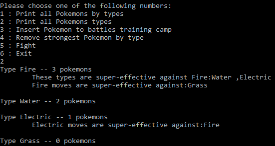
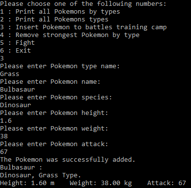
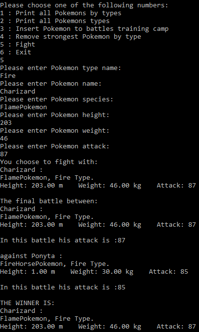
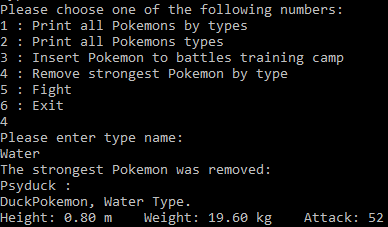

# Pokedex
## Table of contents
* [General info](#general-info)
* [Technologies](#technologies)
* [Supported Methods](#supported-methods)
* [The Project](#the-project)

### General info
This project implements a Pokedex with data about different Pokemons and their types.

The projects also enable the user to set fights between the Pokemons collected and a new pokemon apeared.
	
### Technologies
Project is created with:
* Eclipse's C in Linux.

### Supported Methods
1. Print all Pokemons by types
2. Print all Pokemons types
3. Insert Pokemon to battles training camp
4. Remove strongest Pokemon by type
5. Fight
6. Exit

### The Project

